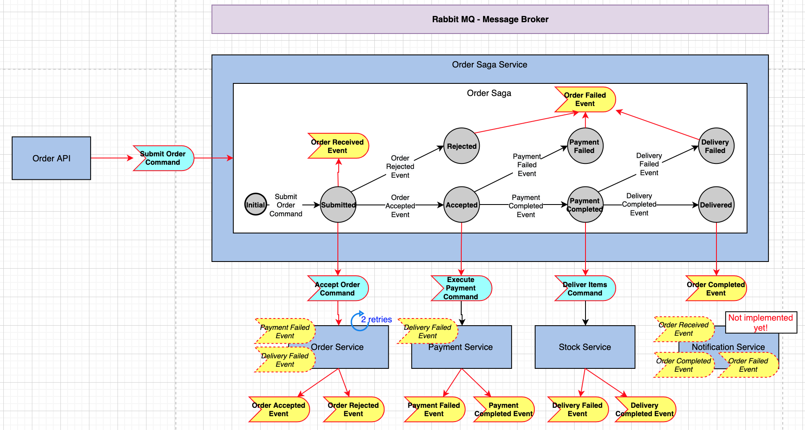

# Order Saga implementation with MassTransit

This sample Order process implementation is to show handling of distributed transactions using ASP.Net Core 3.1, MassTransit library (for message bus), Quartz library (for rescheduled redelivery) and RabbitMQ (for messaging medium).

Below diagram shows the flow and main components of the solution.



## How to run the solution

Start RabbitMQ server as a Docker container

```
docker run -p 15672:15672 -p 5672:5672 masstransit/rabbitmq
```

Start OrderSaga.Service application which runs as a Hosted service and initializes the MassTransit Message Bus and Order Saga State Machine 

```
dotnet run -p OrderSaga.Service
```

Start Order.Api application which runs as a ASP.Net Core application and exposes the Order API as a REST service to the external world

```
dotnet run -p Order.Api
```

Start Order.Service application which runs as a Hosted service and contains order business logic

```
dotnet run -p Order.Service
```

Start Payment.Service application which runs as a console application and contains payment business logic

```
dotnet run -p Payment.Service
```

Start Stock.Service application which runs as a console application and contains stock and delivery business logic

```
dotnet run -p Stock.Service
``` 

Submit a new order over Order.Api and watch application logs to see the event flow

# Business Logic in the service applications

You can test various message flows by setting different values to request message while submitting a new order.

Order.Service
- Failed Retry Count is 2, if that exceeds then order transaction fails completely
- Throws exception for an order message up to given OrderServiceFailCount parameter. You can test retries, scheduled re-delivery feature with this parameter.
- Rejects orders with no items
- Rejects orders if there are items with 0 or negative quantity

Payment.Service
- Rejects payment for orders with no items
- Rejects payment for orders with total quantity of all items more than 10 

Stock.Service
- Rejects delivery for orders with no items
- Rejects delivery for orders with quantity of any item more than 5 


## Other reference implementations
Other projects that I reviewed while building this solution:
- https://github.com/MassTransit/Sample-ShoppingWeb
- https://github.com/welhell/masstransit-saga-example
- https://github.com/selcukusta/masstransit-saga-implementation
- https://github.com/GokGokalp/lightmessagingcore-boilerplate-with-saga